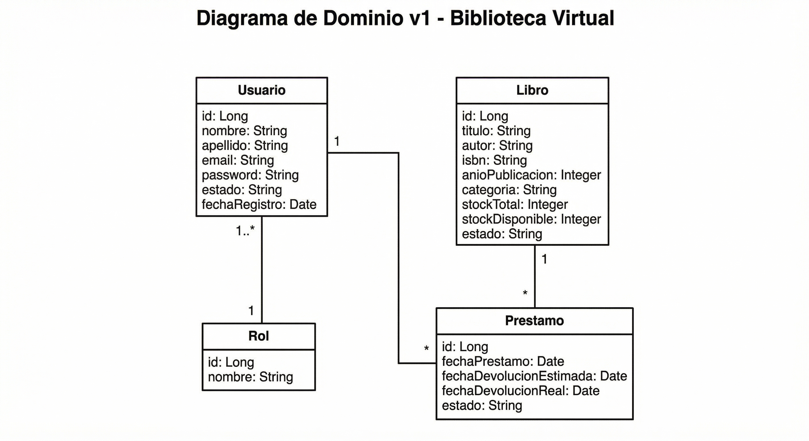

# Biblioteca Virtual

Plataforma web para gestionar préstamos y administración de libros de una biblioteca virtual.

# Introducción / Contexto

- En muchas bibliotecas tradicionales, la gestión de préstamos, devoluciones y control de usuarios se realiza de manera manual o con sistemas poco eficientes. Esto puede generar errores en los registros, dificultades en el seguimiento de libros prestados y problemas en la administración de usuarios.
- La digitalización de estos procesos permite mejorar la organización, reducir errores y facilitar el acceso a la información en tiempo real. Este proyecto es relevante desde el punto de vista académico y tecnológico, ya que permite aplicar conceptos de desarrollo backend con Spring Boot, autenticación, control de roles y gestión de bases de datos relacionales.
- El dominio del proyecto se centra en la gestión bibliotecaria digital, específicamente en la administración de usuarios, libros y préstamos mediante una API REST desarrollada en Java con Spring Boot.

# Objetivos

**Objetivo General**
Desarrollar un sistema backend para la gestión de una biblioteca virtual utilizando Spring Boot.

**Objetivos Específicos**
- Diseñar y desarrollar una API REST para la gestión de usuarios, libros y préstamos.
- Implementar un sistema de autenticación y login para los usuarios.
- Permitir a los usuarios registrarse, solicitar préstamos y devolver libros.
- Implementar roles (usuario y administrador) con permisos diferenciados.
- Gestionar la persistencia de datos mediante una base de datos relacional.
- Aplicar buenas prácticas de arquitectura backend y validación de datos.

# Alcance del Proyecto (Scope)

**Qué se va a desarrollar:**
- Módulo de registro de usuarios.
- Módulo de autenticación (login).
- Gestión de libros (crear, editar, eliminar, listar – rol administrador).
- Gestión de usuarios (listar, bloquear o eliminar – rol administrador).
- Sistema de préstamos y devoluciones de libros.
- Control de disponibilidad de libros.
- API REST documentada.
- Persistencia de datos con base de datos relacional (PostgreSQL).

**Qué NO se va a desarrollar en esta versión (fuera de alcance):**
- Aplicación móvil nativa.
- Sistema de pagos o multas económicas automáticas.
- Integración con bibliotecas físicas reales.
- Recomendaciones inteligentes basadas en IA.
- Notificaciones por correo electrónico o SMS.
- Panel administrativo avanzado con estadísticas gráficas.
- Implementación de microservicios (será arquitectura monolítica).

# Tecnologías y Herramientas (Tech Stack)

- **Backend**: Spring Boot 4.0.3, Java 21, Spring Data JPA, PostgreSQL
- **Frontend**: React
- **Base de datos**: PostgreSQL (entorno principal)
- **Otras herramientas**: Git, GitHub, Postman

# Integrantes del Equipo

| Nombre              | Rol principal           | Usuario GitHub     |
|---------------------|-------------------------|--------------------|
| Esteban Garcés      | Líder / Backend         | @EstebanGarcesA    |
| Estefanía Cataño    | Líder / Frontend        | @Estefania-Catano  |
| Carolina Bolívar    | Desarrolladora          | @CarolinaBolivar5  |
| Cristian Manjarrez  | Desarrollador           | @manjarrezcristian |
| Lorena Mejía        | Desarrolladora          | @Lorenamejiag      |

# Diagrama de Clases del Dominio (v1)


*Diagrama inicial del modelo de dominio – versión 1. Se actualizará en futuras entregas.*

# Instrucciones de Instalación y Ejecución (para desarrolladores)

1. Clonar el repositorio

```bash
git clone https://github.com/EstebanGarcesA/biblioteca-virtual-grupo-3.git
```

2. Entrar al directorio

```bash
cd biblioteca-virtual-grupo-3
```

3. Configurar base de datos en `src/main/resources/application-dev.properties`

Ejemplo con H2 (para pruebas rápidas):

```properties
spring.datasource.url=jdbc:h2:mem:testdb
spring.datasource.driverClassName=org.h2.Driver
spring.datasource.username=sa
spring.datasource.password=
spring.jpa.database-platform=org.hibernate.dialect.H2Dialect
spring.h2.console.enabled=true
spring.jpa.hibernate.ddl-auto=update
```

Ejemplo en PostgreSQL:

```properties
spring.datasource.url=jdbc:postgresql://localhost:5432/biblioteca_virtual
spring.datasource.username=tu_usuario
spring.datasource.password=tu_contraseña
spring.jpa.hibernate.ddl-auto=update
```

4. Ejecutar la aplicación

```bash
./mvnw spring-boot:run
```

O desde el IDE: Run → `BibliotecavirtualApplication`
